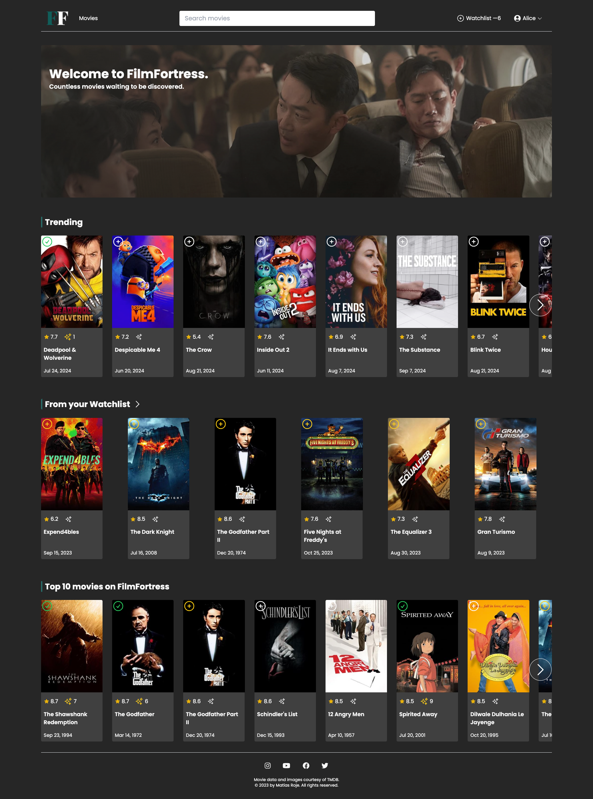
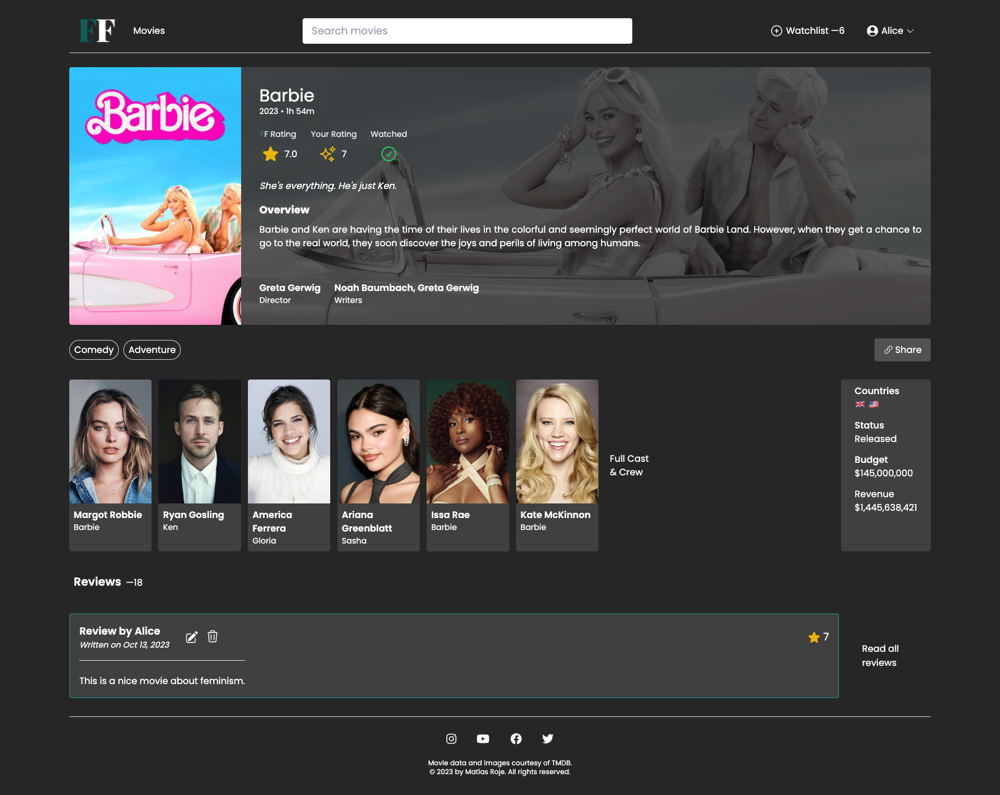
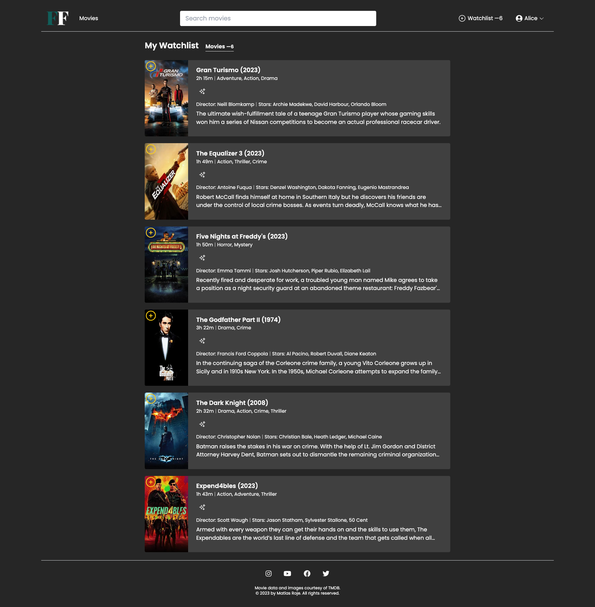
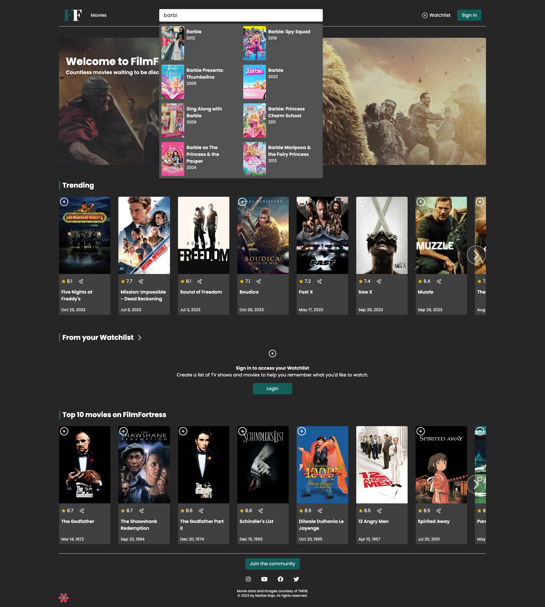
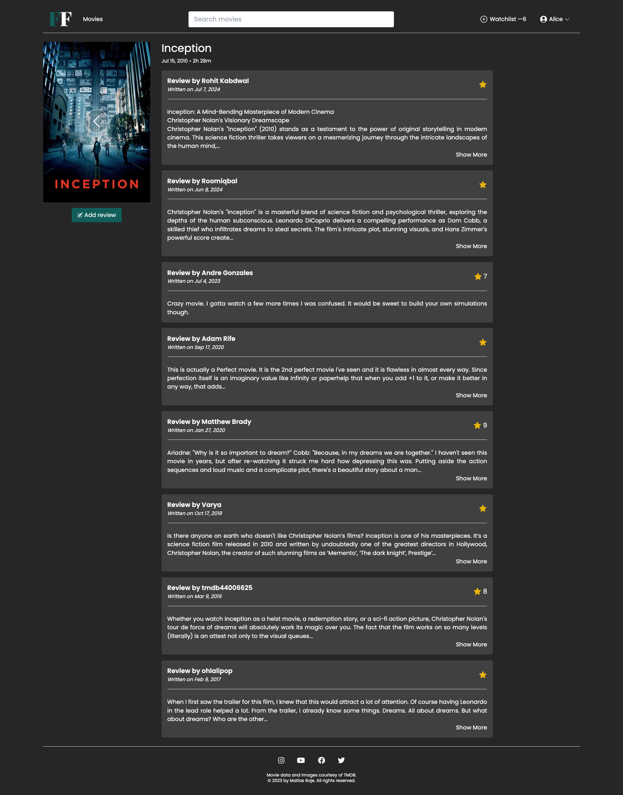
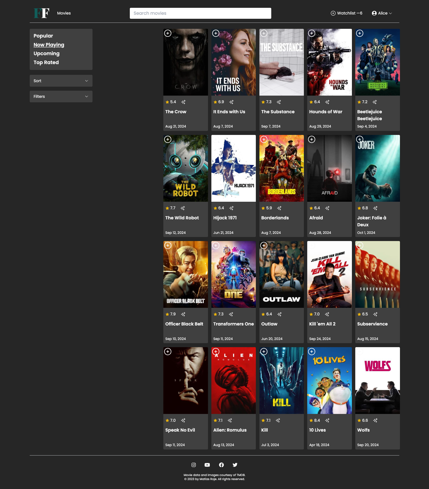

# FilmFortress — Countless movies waiting to be discovered

**Live Demo**: [filmfortress.netlify.app](https://filmfortress.netlify.app/)

FilmFortress is a full-stack, feature-rich movie database website where users can explore movies, discover detailed information, write reviews, rate films, and add them to their personalized watchlist. Built with modern web technologies, FilmFortress offers a sleek and responsive UI/UX design, ensuring an engaging and seamless experience across all devices.

## Technologies Used

- **Next.js**: Server-side rendering framework for React, enhancing performance and SEO.
- **React**: Core JavaScript library for building the dynamic user interface.
- **TypeScript**: Strongly typed language that adds static types to JavaScript, ensuring enhanced type safety and better developer experience.
- **Tailwind CSS**: Utility-first CSS framework, providing a sleek and responsive design across all platforms.
- **React Query**: Data-fetching library used for efficient remote synchronization with the **TMDB API** and **MongoDB**.
- **NextAuth**: Authentication solution for managing secure user sign-in, integrated seamlessly with the app.
- **MongoDB**: A NoSQL database used to store user-generated data such as reviews and watchlists.
- **TMDB API**: Open-source movie database API for fetching real-time movie data.

## Features

- **Complete Movie Database**: Users can explore an extensive database of films fetched from the TMDB API, with detailed information such as ratings, cast, and reviews.
- **User Reviews & Ratings**: Users can write their own reviews and rate movies, contributing to the community-driven feedback on each film.
- **Watchlist Management**: Add movies to a personalized watchlist, so users can track what they plan to watch next.
- **Responsive Design**: The UI is designed to look great on any device, from desktops to mobile phones, ensuring a consistent experience.
- **Seamless User Experience**: With real-time synchronization via React Query, data loading and interactions are optimized, making the browsing experience smooth.
- **Authentication with NextAuth**: Secure login and user management through NextAuth, ensuring data protection and personalized experiences.

## Challenges & Complexity

FilmFortress is a fully-featured full-stack project, showcasing modern web development practices with **Next.js**, **React**, and **TypeScript**. It’s a comprehensive project that combines real-time data from the TMDB API and merges it with user-generated data stored in MongoDB. TypeScript provides enhanced type safety throughout the development process, making this project highly scalable and maintainable. The UI/UX is completely designed by me, reflecting a modern and intuitive user experience.

## Screenshots

  

    
  

  

    
  

  

    
  

  

    
  

  

    
  

  

    
  

